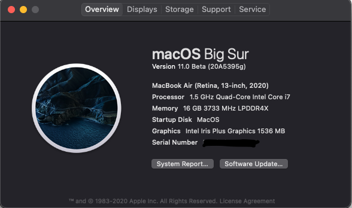

## Dell XPS13 9300

English/[中文](README-CN.md)

**OpenCore Version**: [0.6.2](https://github.com/acidanthera/OpenCorePkg/releases)

**BIOS Version** : 1.2.0

**macOS Version**: macOS Catalina 10.15.7 / Big Sur Beta10

### hardware status

| Hardware                   | Status                                                      |
| ----------------------     | ------------------------------------------------------------|
| CPU - i7-1065G7            | Working - Applying voltageshift for better performance      |
| GPU - Iris Plus Graphics G7| Working - Appple GUC firmwire                               |
| Screen                     | Working - 1920x1200 Non-touch                               |
| RAM                        | Working - On Board 16G                                      |
| SSD                        | Working - 2TB                                               |
| Audio                      | Working - headphones jack need to be fixed by [combojack](https://github.com/leon0410898/XPS13-9300-hackintosh/tree/master/ComboJack_Installer)                                                |                              
| Wireless                   | Working - wifi / handoff                                    |
| Bluetooth                  | Working - airpods pro / apple watch                         |
| SD card reader             | Working                                                     |                     
| Battery                    | Working                                                     |                  
| USB 3.x / USB 2.0          | Working - usb3.1 10Gbps                                     |
| HotKeys                    | Working - mute F1, volume F2/F3, keyboard brightness F5, brightness F6/F7, disable trackpad F10|
| Webcom                     | Working                                                     |
| Laptop KeyBoard            | Working - PS2                                               |
| Laptop Trackpad            | Working - Turn off force touch in System Preferences->trackpad[(#6)](https://github.com/leon0410898/XPS13-9300-hackintosh/issues/6)|
| Sleep                      | Working - S3 sleep                                          |
| Thunderbolt 3              | Partialy working - hotplug not working                      |
| Fingerprint Sensor         | Not working                                                 |

---
## Big Sur 
For the fisrt install. Boot with EFI_big_sir_boot first. It will take a long time to install Big Sur. So, please be patient. After boot into the system, then replace EFI_big_sir_boot with EFI. Finally, make sure to change [Airportitlwm](https://github.com/OpenIntelWireless/itlwm/releases) into Big Sur version.

---

## 4K display 
Thanks to 宪武. He has done a lot of works on 4k display. But still, there are some problems need to be fixed. Please read the [instruction](README_4k_i5.md) first and confirm your cpu model. If your cpu model is not i5-1035G1. You'll need to change your device proverties in config.
            
---

## Bios settings
### Enable :
* SATA Operation : AHCI
* Enable MediaCard : check Enable SD Card (Do not check SD card Boot, it will cause SD card kext fail to load.)
* Fastboot : Thorough

### Disable : 
* Secure Boot
* TPM2.0 Security On
* Intel SGX
* Wake on AC
* Wake on Dell USB-C Dock
* Power On Lid Open 
* Sign Of Life : Early Logo Display 
* VT for Direct I/O
* Fingerprint reader
* cfg lock : DO AT YOUR OWN RISK!!! It may brick your laptop.

---

## Disable CFG lock
For people who want better cpu performance(undervolt, modify PL1,PL2) need to unlock their cfg lock.

*DO AT YOUR OWN RISK!!! It may brick your laptop.*

Follow the guide at :  https://github.com/Not-a-true-statement/Hackintosh-OC-XPS-13-9300

---

## Known Problem
* thunderbolt hotplug not working
* usb-c to hdmi/DP not working

---
## Updated 10.29
* remove fakepciid and improve the stability of AppleALC
* update Big Sur version
* fix the screen brightness is unusually low after sleep

## Updated 10.17
* improve 4k disaplay's backlight.

## Updated 10.14
* fix secound sleep fail issue, sleep/wake now working perfectly (By testing, battery drop 3~4% overnight)
* fix poor sound quailty issue by applying combojack
* undervolt cpu, and modify PL1, PL2 make significant improve on CPU performance.(geekbench5 score original : 12xx/33xx, now : 12xx/43xx)

---

metal score tested on egpu(5700xt)

openCL score tested on egpu(5700xt)

