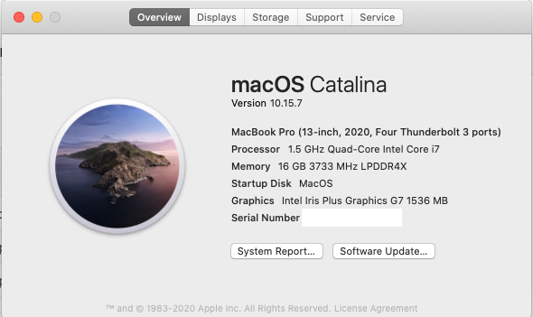
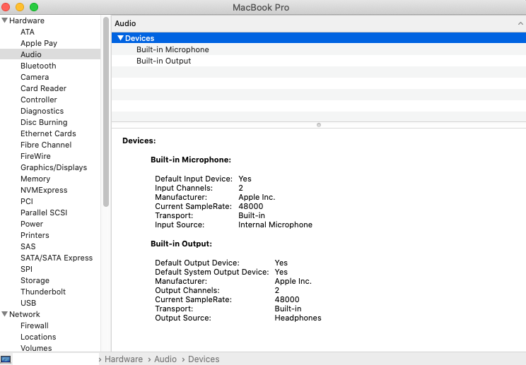
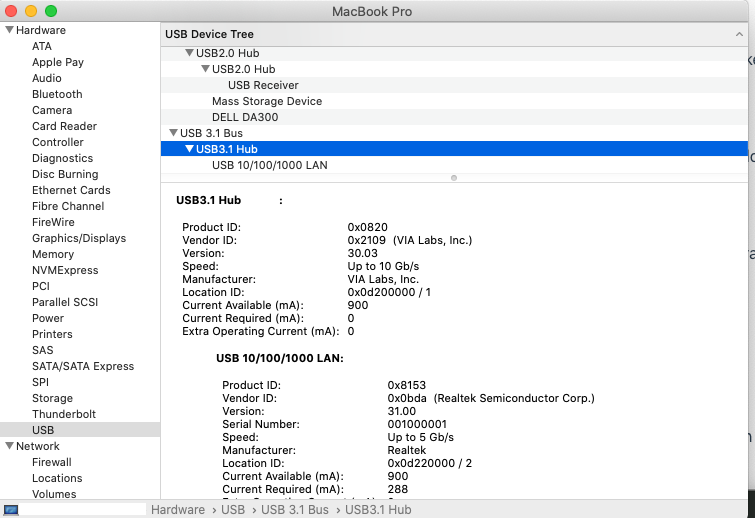
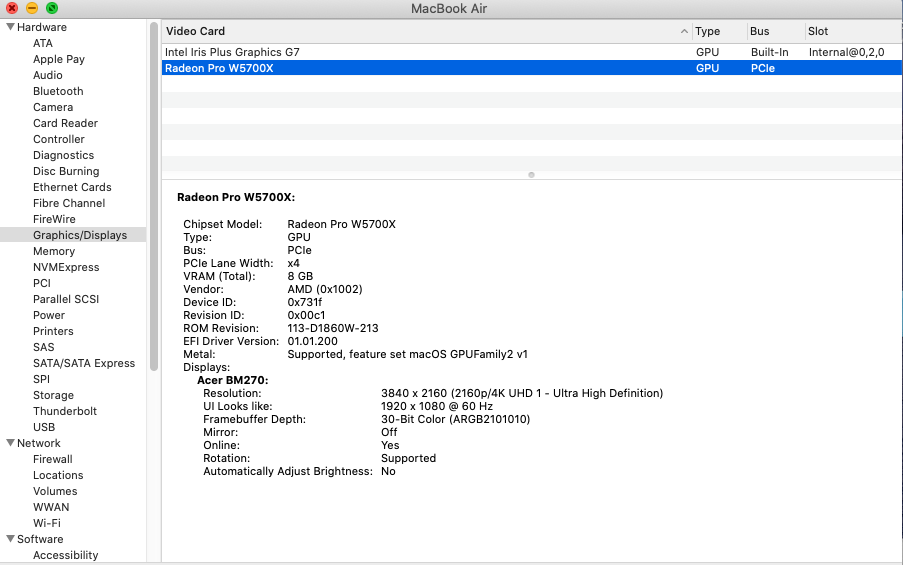
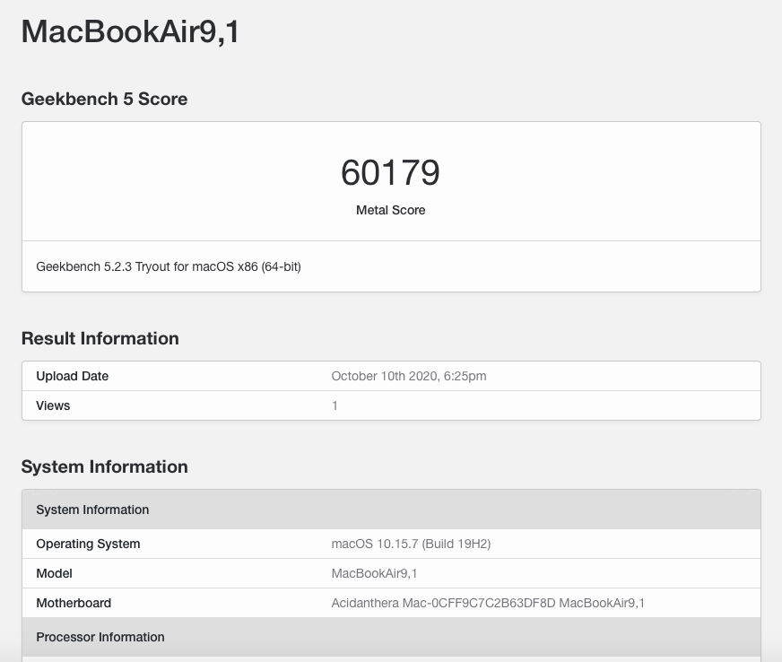
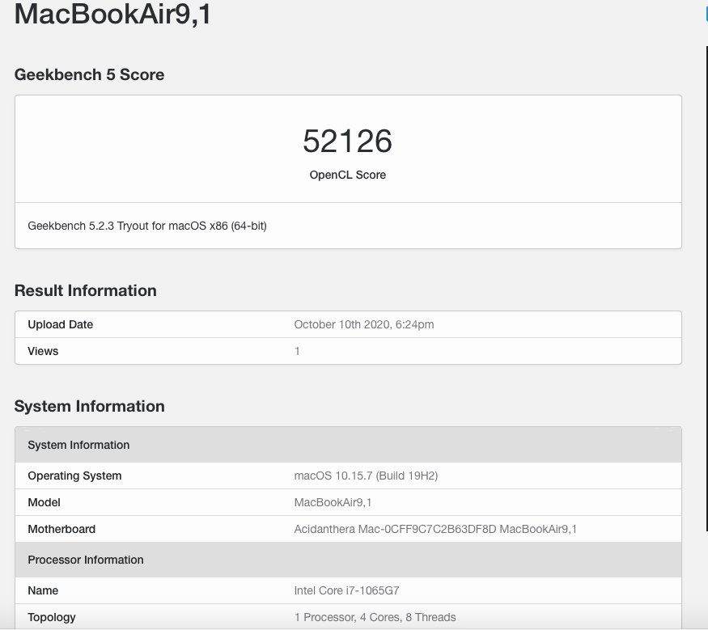

## Dell XPS13 9300

English/[中文](README-CN.md)

**Note1:Thanks to 宪武.He has done a lot of work on 4k display.But still, there are some problems need to be fixed. Please read the [instruction](README_4k_i5.md) first and confirm your cpu model. If your cpu model is not i5-1035G1. You need to change your device proverties in config.**  
            

**Note2 : I AM NOT RESPONSIBLE IF YOU MESS UP YOUR COMPUTER USING THIS GUIDE!**

### Tested software configuration

**OpenCore Version**: [0.6.2](https://github.com/acidanthera/OpenCorePkg/releases)

**BIOS Version** : 1.2.0

**macOS Version**: macOS Catalina 10.15.7 (Big Sur version will update soon) 

### Tested hardware configuration

| Hardware                   | Status                                                      |
| ----------------------     | ------------------------------------------------------------|
| CPU - i7-1065G7            | Working - Applying voltageshift for better performance   |
| GPU - Iris Plus Graphics G7| Working - Appple GUC firmwire is loaded                     |
| Screen - 1920x1200 Non-Touch     | Working                               |
| RAM - 16G                        | Working |
| SSD - Hykvision C2000 2TB        | Working |
| Audio - Realtek ALC289           | Working - headphones jack need to be fixed by combojack |                              
| Wireless - Killer ax1650         | Working - wifi / handoff|
| Bluetooth                        | Working - airpods pro / apple watch |
| SD card reader - Realtek rts525a | Working |                     
| Battery - BYD 52Whr              | Working |                  
| USB 3.x / USB 2.0                | Working |
| HotKeys                          | Working - mute F1, volume F2/F3, video F4, keyboard brightness F5, brightness F6/F7, disable touchpad F10) |
| Webcom | Working |
| Laptop KeyBoard | Working |
|Laptop Trackpad|Working|
|Sleep| Working|
|Thunderbolt 3| Working - hotplug not working|
|Fingerprint Sensor|Not working|

### Known Problem
* thunderbolt hotplug not working
* display may be very dark if wake immediately 
* usb-c to hdmi/DP probably not working

### Updated 10.14

* fix secound sleep fail issue, sleep/wake now working perfectly (By testing, battery drop 3~4% overnight)
* fix poor sound quailty issue by applying combojack
* undervolt cpu, and modify PL1, PL2 make significant improve on CPU performance.(geekbench5 score original : 12xx/33xx, now : 12xx/43xx)

metal score tested on egpu(5700xt)

openCL score tested on egpu(5700xt)

